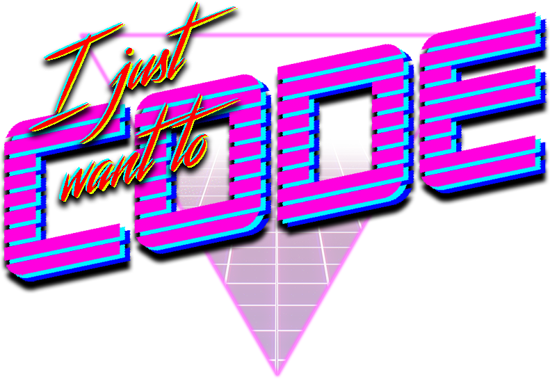
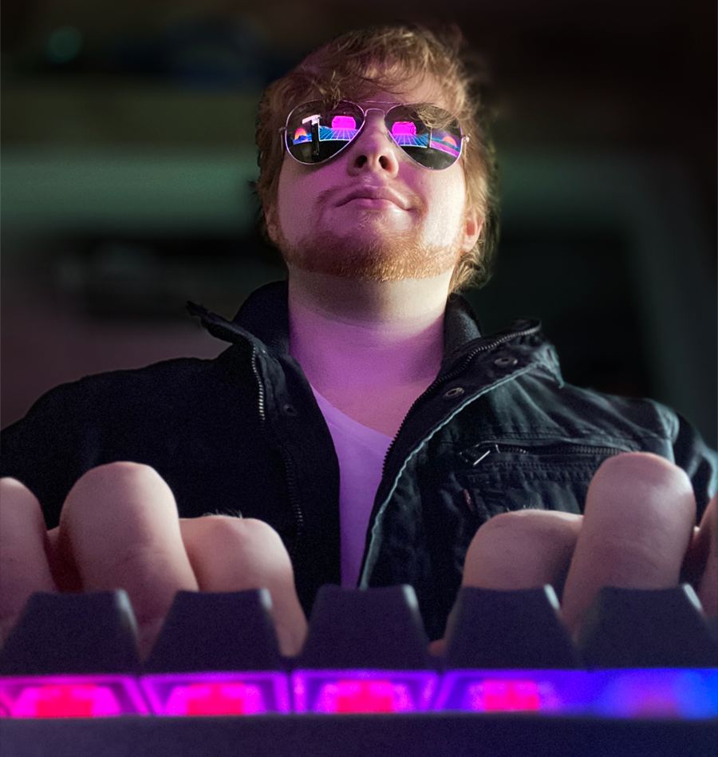

<!--  -->

  

Nerd who likes to spend his free time optimizing his old code.

I graduated from the University of Central Florida in Spring 2019 with a B.S. in Computer Science and went on to the Florida Interactive Entertainment Academy, from which I will graduate in Fall 2020 with an M.S. in Interactive Entertainment.

Currently pursuing work as an game engine/tools programmer.

[Leaf Theme](https://github.com/SupunKavinda/jekyll-theme-leaf) by [Supun Kavinda](https://twitter.com/_SupunKavinda).
Background from [svgbackgrounds.com](https://www.svgbackgrounds.com/).

